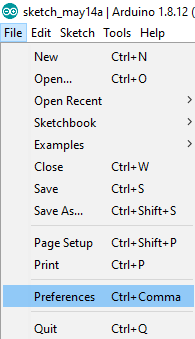
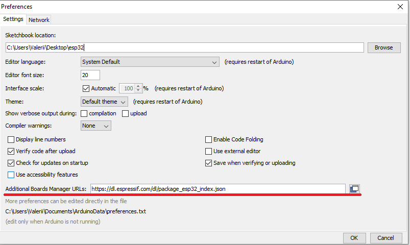
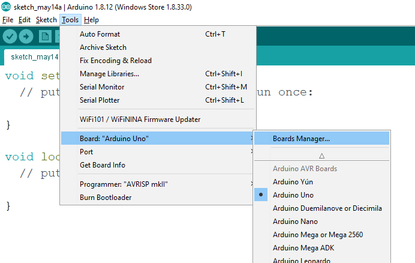
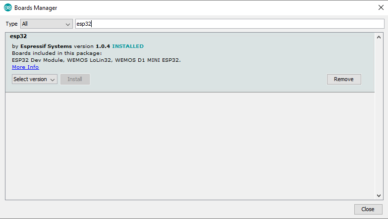

This instruction for Arduino 1.8.12.

# Setup

* Download and install [Arduino IDE](https://www.arduino.cc/en/Main/Software)
* Open the Arduino IDE and go to Files -> Preferences 
* Find text box - “Additional Boards Manager URLs:” 
* Put _https://dl.espressif.com/dl/package\_esp32\_index.json_ to the text box 
* Go to Tools -> Boards -> Board Managers 
* Find ESP32 package in the Board Managers 
* Choose install
